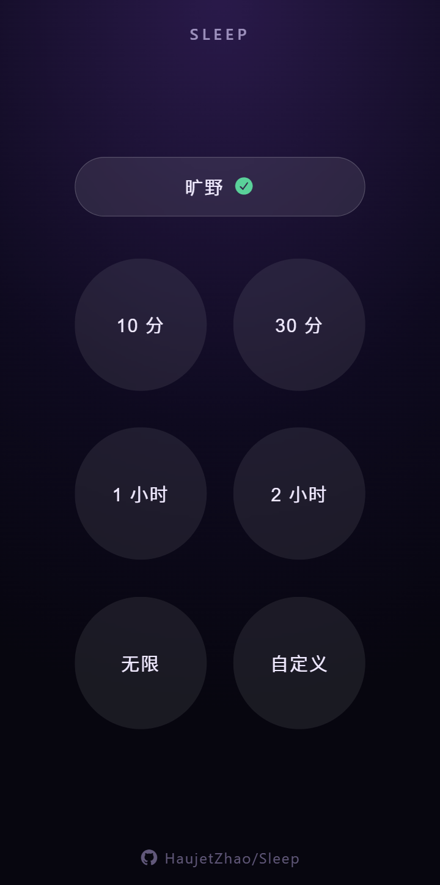

# Sleep · 助眠环境音



> 高质量环境音，无缝循环，倒计时停，移动端熄屏持续播放，用于助眠。

## 开发动机

晚上躺下后脑子常常钻到一个想法，越陷越深，越想越清醒，翻来覆去睡不着。这时候需要一段环境音把注意力分散出去，让大脑从「想」切换到「听」，才能慢慢沉下来。

可市面上的白噪音 / 环境音软件，几乎都钻进付费钱眼里了：点开就是一堆花里胡哨的功能、会员弹窗、广告，环境音的音质还不咋地，一点都没有氛围感。Sleep 想做的就一件事——**高质量环境音，定时无缝循环，点开即用**，没有花活。

## 特性

- **无缝循环** —— 高质量环境音循环播放，相邻两段 5 秒重叠交叉淡变
- **多音源** —— 打雷下雨 / 倾盆大雨 / 淅沥下雨 / 海边礁石 / 夜晚蟋蟀青蛙 / 旷野
- **倒计时停止** —— 预设 10 分 / 30 分 / 1 小时 / 2 小时 / 无限 / 自定义（径向圆盘选择器）
- **可安装 / 可离线** —— PWA，断网可用

## 用法

**直接用**（任选其一）：

- 在线用：访问 [Sleep Pages](https://haujetzhao.github.io/Sleep/)（PWA，支持安装到主屏 / 离线使用）
- 离线用：下载 [Sleep.html](https://github.com/HaujetZhao/Sleep/releases/latest/download/Sleep.html)，双击打开（mp3 / 字体全内联）

**本地开发**：

```bash
npm install
npm run dev          # 开发服务器（手机测试用输出的 Network 地址，同 WiFi），端口默认 5184，被占会自动跳
npm run build        # 产出单文件 dist/index.html（mp3/字体全内联，U 盘 file:// 直开）
npm run build:pwa    # 产出 PWA 多文件 dist/（给 GitHub Pages，含 service worker）
npm run preview      # 配合 build:pwa 本地预览 PWA
```

## 素材来源

`src/audio/` 下的高质量音频来自 **[Adobe Audition Sound Effects](https://www.adobe.com/products/audition/offers/AdobeAuditionDLCSFX.html)**

| 音频名 | 来源 |
|---|---|
| 01 - 打雷下雨.mp3 | `Weather\Weather Ambience Heavy Rain Thunderstorm Thunder 01.wav` |
| 02 - 倾盆大雨.mp3 | `Weather\Weather Ambience Heavy Rain Downpour Splatty 01.wav` |
| 03 - 淅沥下雨.mp3 | `Weather\Weather Ambience Rain Drips Water Splatty 01.wav` |
| 04 - 海边礁石.mp3 | `Ambience_2\Ambience Ocean Shore 01.wav` |
| 05 - 夜晚蟋蟀青蛙.mp3 | `Ambience_2\Ambience Night Crickets And A Bullfrog 01.wav` |
| 06 - 旷野.mp3 | `Ambience_2\Ambience Wilderness 01.wav` |

图标来自于 **[Font Awesome Free](https://fontawesome.com)** 的 `fa-bed` 图标。
